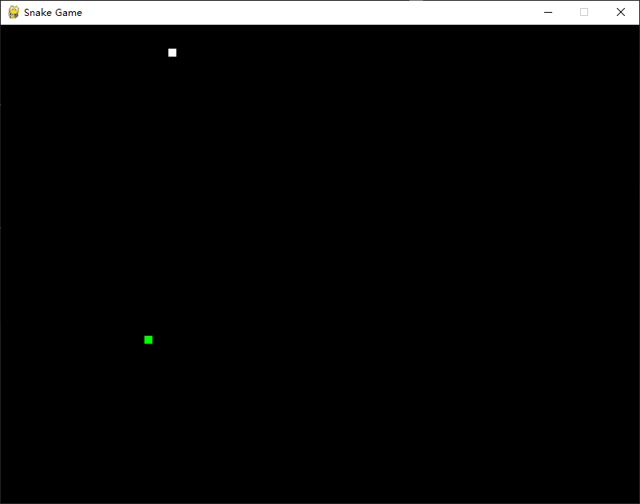

# gpt-generate-demo

一些用gpt生成的代码案例。

使用[Cursor](https://www.cursor.so/)编辑器生成，各方面都能生成，一些复杂的还没测试，但是简单的确实生成的挺好， 然后目前还免费，速度也很快，虽然偶尔会断连。

# 如何运行起来：
   - 安装Python和Pygame
   - 下载代码文件
   - 在命令行中进入代码文件所在目录
   - 运行命令：python tank.py 或者 python snake.py

部分截图

## 一些简单的思考

能更快速的帮你实现一个新的技术栈的一些demo，能更好的上手这个技术栈，对上手这个技术栈的时候看到的一些项目，不懂的去问它能够快速的提高。

